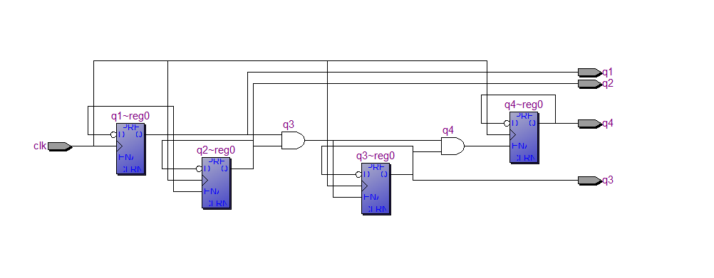
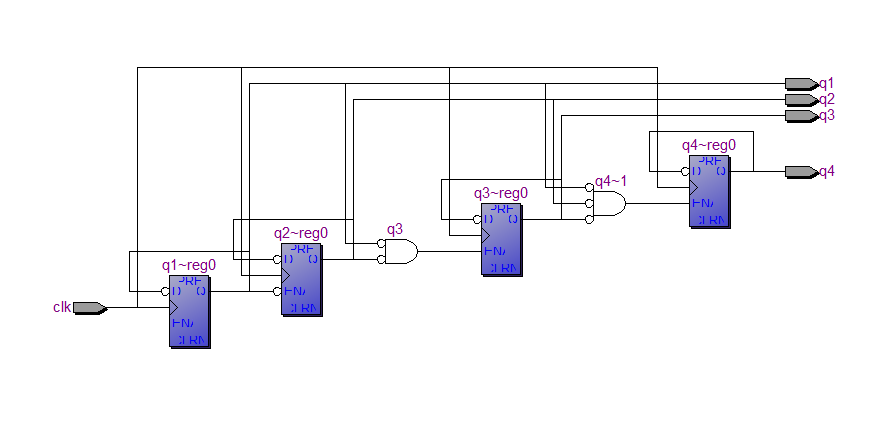

### Ex. No. 6
#### Date: 19.5.23
# Implementation of 4 bit synchronous counters using Verilog HDL
## Aim:
To design and implement the following synchronous counters using Verilog HDL.
1.	UP counter
2.	DOWN counter
## Components Required:
1.	Laptop with Quartus software and modelsim software.
## Theory:
A Synchronous counter is the counter in which the clock input with all the flip-flops uses the same source and produces the output at the same time.
## UP Counter
### State table

### K-map Simplification

   
   
### Logic Diagram

## DOWN Counter
### State Table
 

### K-map simplification
 

### Logic Diagram
 

## Procedure:
1.	Type the program in Quartus software.
2.	Compile and run the program.
3.	Generate the RTL schematic and save the logic diagram.
4.	Create nodes for inputs and outputs to generate the timing diagram.
5.	For different input combinations, generate the timing diagram.

## Program:
## 1.UP Counter: 
module upcounter(clk,q1,q2,q3,q4); 
input clk; 
output reg q1,q2,q3,q4; 
always@(posedge clk) 
begin 
q4=(q1&q2&q3)^q4; 
q3=(q1&q2)^q3; 
q2=q1^q2; 
q1=1^q1; 
end 
endmodule 
## 2.DOWN Counter: 
module downcounter(clk,q1,q2,q3,q4); 
input clk; 
output reg q1,q2,q3,q4; 
always@(posedge clk) 
begin 
q4=((~q3)&(~q2)&(~q1))^q4; 
q3=((~q2)&(~q1))^q3; 
q2=(~q1)^q2; 
q1=1^q1; 
end 
endmodule 
## RTL Schematic:
## 1.UP Counter: 
 
## 2.DOWN Counter: 
 
## Timing Diagram:
## 1.UP Counter: 
 
## 2.DOWN Counter: 
 
## Result:
Thus the Synchronous UP and DOWN counters using T flipflops are implemented and the state tables are verified.

